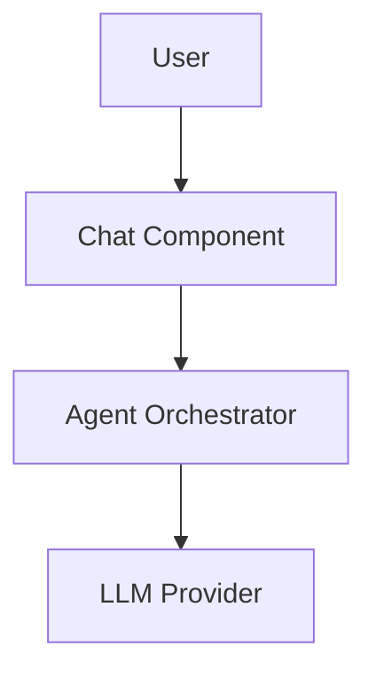

# Documentation Design Proposal

**Created**: 2025-11-08
**Last Updated**: 2025-11-08
**Status**: ✅ Approved with Refinements
**Purpose**: Reorganize project documentation for clarity, maintainability, and scalability

---

## Approval Status

**Approved Decisions**:
- ✅ Use numbering for top-level directories only (`01-getting-started/`, not subdirectories)
- ✅ Concepts folder for cross-cutting features (Teaching Mode belongs here)
- ✅ Archive session docs immediately (Option A)
- ✅ Remove TDD guide (covered by `.claude/skills/tdd/`)
- ✅ **Add clear scope headers to all files** (prevent AI agents from misusing docs)

**Pending**:
- ⏳ Component documentation timing (details to be provided later)

---

## Executive Summary

This proposal redesigns the TransparentAiAgent documentation structure to address current pain points: chaotic organization, unclear hierarchy, difficulty updating, and poor support for cross-cutting concepts like Teaching Mode.

**Current State**: 19 files at root level, unclear categorization, mix of architecture/guides/session notes
**Proposed State**: Hierarchical structure with 9 categories, clear navigation, templates, style guide, and **scope headers**

---

## Current Problems

### 1. Chaotic Root Directory
- **19 markdown files** at `docs/` root level
- No clear categorization
- Mix of architecture, guides, troubleshooting, session notes
- Difficult to find relevant documentation

### 2. Unclear Hierarchy
- What to read first? What's foundational vs. advanced?
- No clear learning paths
- Cross-cutting concepts (Teaching Mode) scattered across multiple docs

### 3. Inconsistent Naming & Organization
- Some files use `SCREAMING_SNAKE_CASE.md`
- Some use `Sentence Case.md`
- No standard structure within documents

### 4. Components Folder Underutilized
- Only `README.md` files exist
- No detailed component documentation
- Missing: architecture details, implementation notes, testing strategies

### 5. Cross-Cutting Concepts Poorly Organized
- Teaching Mode spans 3+ docs (VISION, ROADMAP, ARCHITECTURE)
- No dedicated "concepts" area
- Hard to understand features that transcend components

### 6. Temporary Docs Mixed with Permanent
- `SESSION_SUMMARY.md`, `STARTUP_FIX_SUMMARY.md` mixed with core docs
- No archive for historical/session-specific content

### 7. No Documentation Standards
- No templates for different doc types
- No style guide
- Inconsistent formatting and structure

### 8. No Scope Boundaries (AI Agent Problem) ⚠️
- **Critical Issue**: AI agents put content in wrong places
  - Code snippets in architecture docs
  - Session notes in guides
  - Implementation details in overview docs
- No clear "what belongs here" statement at file headers
- Leads to documentation decay and confusion

---

## Proposed Structure

### Overview

```
docs/
├── README.md                          # Main navigation/index
│
├── 01-getting-started/               # Quick onboarding
│   ├── README.md
│   ├── quick-start.md
│   ├── installation.md
│   └── first-conversation.md
│
├── 02-architecture/                  # System design
│   ├── README.md
│   ├── overview.md
│   ├── clean-architecture.md
│   ├── layers-and-flow.md
│   ├── design-patterns.md
│   └── design-decisions.md          # DD log
│
├── 03-concepts/                      # Cross-cutting features ⭐ NEW
│   ├── README.md
│   ├── transparency.md
│   ├── context-management.md
│   ├── teaching-mode/               # Multi-doc concepts get subfolder
│   │   ├── README.md
│   │   ├── vision.md
│   │   ├── architecture.md
│   │   └── implementation-roadmap.md
│   ├── tool-system.md
│   ├── streaming.md
│   └── mcp-protocol.md
│
├── 04-components/                    # Detailed component docs
│   ├── README.md
│   ├── core/
│   │   ├── README.md
│   │   ├── agent-orchestrator.md
│   │   ├── conversation-manager.md
│   │   └── message-pipeline.md
│   ├── llm/
│   │   ├── README.md
│   │   ├── provider-abstraction.md
│   │   ├── azure-openai-provider.md
│   │   └── anthropic-provider.md
│   ├── tools/
│   │   ├── README.md
│   │   ├── tool-manager.md
│   │   ├── mcp-client.md
│   │   ├── tool-registry.md
│   │   └── ui-control-tools.md
│   ├── infrastructure/
│   │   ├── README.md
│   │   ├── configuration-manager.md
│   │   ├── authentication-manager.md
│   │   ├── transparency-system.md
│   │   └── serialization-service.md
│   └── ui/
│       ├── README.md
│       ├── chat-component.md
│       ├── transparency-viewer.md
│       ├── tools-overview.md
│       └── state-management.md
│
├── 05-guides/                        # How-to documentation
│   ├── README.md
│   ├── development/
│   │   ├── README.md
│   │   ├── adding-llm-provider.md
│   │   ├── adding-component.md
│   │   ├── testing-strategy.md
│   │   └── debugging-tips.md
│   │   # Note: TDD workflow covered by .claude/skills/tdd/
│   ├── deployment/
│   │   ├── README.md
│   │   ├── local-deployment.md
│   │   ├── configuration-guide.md
│   │   └── troubleshooting.md
│   └── integration/
│       ├── README.md
│       ├── mcp-servers.md
│       ├── custom-tools.md
│       └── oauth-setup.md
│
├── 06-reference/                     # API specs and provider docs
│   ├── README.md
│   ├── api/
│   │   ├── README.md
│   │   ├── interfaces.md
│   │   ├── models.md
│   │   └── configuration-schema.md
│   ├── providers/
│   │   ├── README.md
│   │   ├── anthropic/              # Keep existing structure
│   │   │   ├── README.md
│   │   │   ├── 01-api-reference.md
│   │   │   ├── 02-tool-calling.md
│   │   │   ├── 03-streaming.md
│   │   │   ├── 04-sdk-reference.md
│   │   │   ├── 05-model-comparison.md
│   │   │   ├── 06-common-issues.md
│   │   │   └── 07-implementation-fixes.md
│   │   └── azure-openai/
│   │       ├── README.md
│   │       └── authentication.md
│   ├── blazor/
│   │   ├── README.md
│   │   ├── hosting-comparison.md
│   │   └── practical-examples.md
│   └── quick-reference.md           # One-page cheatsheet
│
├── 07-planning/                      # Project management
│   ├── README.md
│   ├── requirements.md
│   ├── roadmap.md
│   └── phases/
│       ├── phase-01-foundation.md
│       ├── phase-02-llm-integration.md
│       ├── phase-03-agent-core.md
│       ├── phase-04-basic-ui.md
│       ├── phase-05-mcp-integration.md
│       ├── phase-06-enhanced-ui.md
│       ├── phase-07-config-ui.md
│       ├── phase-08-anthropic.md
│       └── phase-09-teaching-mode.md
│
├── 08-contributing/                  # Documentation standards ⭐ NEW
│   ├── README.md
│   ├── documentation-guide.md
│   ├── style-guide.md
│   └── templates/
│       ├── component-template.md
│       ├── concept-template.md
│       ├── guide-template.md
│       ├── reference-template.md
│       └── decision-template.md
│
└── 09-archive/                       # Historical/session docs ⭐ NEW
    ├── README.md
    ├── sessions/
    │   ├── 2025-11-03-session-summary.md
    │   └── ...
    └── implementation-notes/
        ├── startup-fix-summary.md
        ├── oauth-implementation-notes.md
        └── ...
```

---

## Documentation Categories Explained

### 1. Getting Started (`01-getting-started/`)
**Purpose**: Onboard new users/developers quickly
**Audience**: First-time users, new team members
**Content**:
- Quick start guide (5-10 minutes)
- Installation instructions
- First conversation walkthrough
- Links to deeper docs

**Example**: `quick-start.md` → Install → Run → Chat → Explore

---

### 2. Architecture (`02-architecture/`)
**Purpose**: Explain system design and structure
**Audience**: Developers, architects
**Content**:
- High-level overview
- Clean Architecture explanation
- Layer responsibilities and dependencies
- Data flow diagrams
- Key design patterns
- Design decisions log (DD-001 through DD-0XX)

**Example**: `overview.md` → 4 layers → Dependencies point inward → Diagram

---

### 3. Concepts (`03-concepts/`) ⭐ **NEW**
**Purpose**: Explain cross-cutting features and ideas
**Audience**: All users
**Content**:
- Transparency: what it means, how it works
- Context Management: truncation, indicators
- Teaching Mode: vision, architecture, usage (subfolder for complex concepts)
- Tool System: MCP integration, UI control tools
- Streaming: how LLM responses flow
- MCP Protocol: what it is, why we use it

**Key Insight**: This is where Teaching Mode docs belong—it's a concept that spans multiple components!

---

### 4. Components (`04-components/`)
**Purpose**: Document each component in detail
**Audience**: Developers implementing/maintaining components
**Content** (per component):
- **Purpose**: What the component does
- **Responsibilities**: Specific duties
- **Architecture**: Internal design
- **Interfaces**: Public contracts (IXxx)
- **Dependencies**: What it depends on
- **Implementation Notes**: Key algorithms, patterns
- **Testing Strategy**: How to test it
- **Usage Examples**: Code snippets

**Template**: Use `component-template.md` for consistency

---

### 5. Guides (`05-guides/`)
**Purpose**: Step-by-step how-to documentation
**Audience**: Developers performing specific tasks
**Categories**:
- **Development**: TDD workflow, adding providers/components, testing
- **Deployment**: Local setup, configuration, troubleshooting
- **Integration**: MCP servers, custom tools, OAuth

**Format**: Task-oriented, actionable steps

**Example**: "How to Add a New LLM Provider" → Steps 1-10 with code

---

### 6. Reference (`06-reference/`)
**Purpose**: Detailed specifications and API documentation
**Audience**: Developers needing exact details
**Content**:
- **API**: Interfaces, models, configuration schema
- **Providers**: Anthropic, Azure OpenAI (keep existing structure!)
- **Blazor**: Hosting models, examples
- **Quick Reference**: One-page cheatsheet for common lookups

**Note**: Provider-specific docs stay organized by provider (good pattern from `anthropic/`)

---

### 7. Planning (`07-planning/`)
**Purpose**: Project roadmap and requirements
**Audience**: Project stakeholders, developers
**Content**:
- Requirements document
- Implementation roadmap (high-level)
- Phase-by-phase detailed plans
- Status tracking

**Example**: Phase 9 Teaching Mode plan with timeline, tasks, acceptance criteria

---

### 8. Contributing (`08-contributing/`) ⭐ **NEW**
**Purpose**: Documentation standards and templates
**Audience**: Documentation writers
**Content**:
- **Documentation Guide**: How to contribute docs, when to create new docs
- **Style Guide**: Naming, formatting, structure standards
- **Templates**: Pre-built structures for different doc types

**Why**: Ensures consistency and makes updates easier

---

### 9. Archive (`09-archive/`) ⭐ **NEW**
**Purpose**: Historical and session-specific documentation
**Audience**: Reference only (not active docs)
**Content**:
- Session summaries (dated)
- Implementation notes from specific fixes
- Deprecated documentation

**Why**: Keeps root clean while preserving history

---

## File Naming Conventions

### Directories
- **Use kebab-case**: `getting-started`, `architecture`, `teaching-mode`
- **Prefix with numbers** for ordering: `01-getting-started`, `02-architecture`
- **Descriptive**: Name should indicate contents

### Files
- **Use kebab-case**: `quick-start.md`, `design-decisions.md`
- **Descriptive**: `azure-openai-provider.md` not `azure.md`
- **READMEs**: Each directory has `README.md` as index
- **Dates in archive**: `2025-11-03-session-summary.md`

### Avoid
- ❌ `SCREAMING_CASE.md`
- ❌ `Sentence Case With Spaces.md`
- ❌ Abbreviations: `arch.md`, `comp.md`
- ❌ Generic names: `doc1.md`, `notes.md`

---

## Document Structure Standards

### Every Document Should Have

1. **Front Matter with Scope Header** ⭐ **CRITICAL**:
   ```markdown
   # Document Title

   **Last Updated**: YYYY-MM-DD
   **Status**: Active | Draft | Archived
   **Audience**: Developers | Users | All

   ---

   ## 📋 Document Scope

   **What belongs in this document**:
   - Specific type of content (e.g., "Architecture diagrams and layer descriptions")
   - Specific level of detail (e.g., "High-level overviews, not implementation code")
   - Examples of appropriate content

   **What does NOT belong here**:
   - ❌ Code snippets (→ belongs in component docs or guides)
   - ❌ Session notes (→ belongs in archive)
   - ❌ Implementation details (→ belongs in component docs)

   **Purpose**: This scope header prevents documentation decay by clearly defining boundaries.
   AI agents and human contributors should verify content matches the scope before adding.

   ---
   ```

   **Why This Matters**: Without clear scope boundaries, AI agents will put:
   - Code snippets in architecture docs
   - Session summaries in guides
   - Implementation details in overviews

   This leads to documentation chaos. **Every document must have a scope header.**

2. **Table of Contents** (for docs >3 sections):
   ```markdown
   ## Table of Contents
   - [Section 1](#section-1)
   - [Section 2](#section-2)
   ```

3. **Clear Sections**:
   - Use `##` for main sections
   - Use `###` for subsections
   - Use `####` sparingly

4. **Cross-References**:
   ```markdown
   See [Architecture Overview](../02-architecture/overview.md) for details.
   ```

5. **Code Examples**:
   ````markdown
   ```csharp
   // Well-commented code
   public interface IExample { }
   ```
   ````

6. **Visual Aids** (when helpful):
   - Diagrams (ASCII art or Mermaid)
   - Tables for comparisons
   - Lists for steps

---

## Templates

### Component Documentation Template

Located at: `08-contributing/templates/component-template.md`

```markdown
# [Component Name]

**Last Updated**: YYYY-MM-DD
**Status**: Active
**Phase**: Phase X
**Layer**: Domain | Application | Infrastructure | Presentation

---

## 📋 Document Scope

**What belongs in this document**:
- Detailed documentation for the [Component Name] component
- Purpose, responsibilities, and architecture
- Interface definitions and contracts
- Dependencies and relationships with other components
- Implementation notes and design patterns
- Testing strategies specific to this component
- Usage examples with code

**What does NOT belong here**:
- ❌ General architecture overviews (→ belongs in 02-architecture/)
- ❌ Cross-cutting concepts (→ belongs in 03-concepts/)
- ❌ Step-by-step guides (→ belongs in 05-guides/)
- ❌ Session notes or temporary fixes (→ belongs in 09-archive/)

---

## Overview

Brief description of what this component does (2-3 sentences).

## Purpose

Why this component exists and what problem it solves.

## Responsibilities

- Responsibility 1
- Responsibility 2
- Responsibility 3

## Architecture

### Interfaces

\`\`\`csharp
public interface IComponentName
{
    // Public contract
}
\`\`\`

### Dependencies

- **Depends on**: List of dependencies
- **Used by**: List of consumers

### Internal Structure

Diagram or description of internal organization.

## Implementation Notes

### Key Algorithms

### Design Patterns Used

### Important Considerations

## Configuration

What configuration this component needs (if any).

## Testing Strategy

### Unit Tests

What to test, how to mock dependencies.

### Integration Tests

How this component integrates with others.

## Usage Examples

\`\`\`csharp
// Example code
\`\`\`

## Related Documentation

- [Related Doc 1](path)
- [Related Doc 2](path)

---

**See Also**: [Component Overview](../README.md)
```

### Concept Documentation Template

Located at: `08-contributing/templates/concept-template.md`

```markdown
# [Concept Name]

**Last Updated**: YYYY-MM-DD
**Status**: Active
**Audience**: All | Developers | Users

---

## 📋 Document Scope

**What belongs in this document**:
- Explanation of the [Concept Name] concept
- High-level philosophy and principles
- How the concept works across multiple components
- Use cases and examples
- Best practices and common pitfalls
- Related documentation links

**What does NOT belong here**:
- ❌ Component-specific implementation details (→ belongs in 04-components/)
- ❌ Step-by-step how-to guides (→ belongs in 05-guides/)
- ❌ Code snippets (→ belongs in component docs or guides)
- ❌ Architecture diagrams (→ belongs in 02-architecture/)

---

## What is [Concept]?

High-level explanation in simple terms.

## Why is this Important?

Value proposition and benefits.

## How it Works

Detailed explanation with diagrams if needed.

### Key Principles

1. Principle 1
2. Principle 2

## Use Cases

### Use Case 1: [Name]
Description and example.

### Use Case 2: [Name]
Description and example.

## Implementation

How this concept is implemented in the system.

### Components Involved

- Component 1
- Component 2

### Data Flow

Diagram or description.

## Best Practices

- Best practice 1
- Best practice 2

## Common Pitfalls

- Pitfall 1 and how to avoid
- Pitfall 2 and how to avoid

## Related Documentation

- [Related Doc 1](path)
- [Related Doc 2](path)

---
```

### Guide Template

Located at: `08-contributing/templates/guide-template.md`

```markdown
# How to [Task Name]

**Last Updated**: YYYY-MM-DD
**Difficulty**: Beginner | Intermediate | Advanced
**Estimated Time**: X minutes/hours

---

## 📋 Document Scope

**What belongs in this document**:
- Step-by-step instructions for completing [Task Name]
- Prerequisites and setup
- Detailed steps with code/commands
- Verification procedures
- Troubleshooting for this specific task
- Links to related guides

**What does NOT belong here**:
- ❌ Conceptual explanations (→ belongs in 03-concepts/)
- ❌ Component architecture (→ belongs in 04-components/)
- ❌ General architecture (→ belongs in 02-architecture/)
- ❌ API reference (→ belongs in 06-reference/)

---

## Prerequisites

- Prerequisite 1
- Prerequisite 2

## Overview

What you'll accomplish by following this guide.

## Steps

### Step 1: [Action]

Description and code/commands.

\`\`\`bash
# Commands
\`\`\`

### Step 2: [Action]

Description and code/commands.

### Step 3: [Action]

Description and code/commands.

## Verification

How to verify you completed the task successfully.

\`\`\`bash
# Verification commands
\`\`\`

## Troubleshooting

### Issue 1
**Symptom**: What you see
**Solution**: How to fix

### Issue 2
**Symptom**: What you see
**Solution**: How to fix

## Next Steps

Where to go from here.

## Related Documentation

- [Related Doc 1](path)
- [Related Doc 2](path)

---
```

### Design Decision Template

Located at: `08-contributing/templates/decision-template.md`

**Note**: Design decisions are logged in `02-architecture/design-decisions.md` as sections, not separate files.

**File Scope** (for design-decisions.md):
- ✅ Architectural and technical decisions with rationale
- ✅ Context, options considered, consequences
- ❌ Implementation code (→ belongs in components)
- ❌ Session notes (→ belongs in archive)

```markdown
### DD-XXX: [Decision Title]

**Date**: YYYY-MM-DD
**Status**: Proposed | Accepted | Deprecated

**Context**:
Why this decision was needed (background, problem statement).

**Decision**:
What was decided (clear, concise statement).

**Options Considered**:
1. Option 1
   - Pros: ...
   - Cons: ...
2. Option 2
   - Pros: ...
   - Cons: ...
3. Option 3
   - Pros: ...
   - Cons: ...

**Rationale**:
Why this option was chosen over alternatives.

**Consequences**:
- Positive consequence 1
- Positive consequence 2
- Trade-off 1
- Trade-off 2

**Related Decisions**:
- DD-XXX
- DD-YYY

---
```

---

## Style Guide Highlights

### Markdown Formatting

**Headings**:
- H1 (`#`): Document title only
- H2 (`##`): Main sections
- H3 (`###`): Subsections
- H4 (`####`): Rare, for deep nesting

**Lists**:
- Use `-` for unordered lists
- Use `1.` for ordered lists
- Indent with 2 spaces for nested items

**Emphasis**:
- `**bold**` for important terms
- `*italic*` for emphasis
- `` `code` `` for inline code/technical terms
- ``` ``` ``` for code blocks (always specify language)

**Links**:
- Use relative paths: `[Link](../path/to/doc.md)`
- Use descriptive text: `[Architecture Overview](...)` not `[Click here](...)`

**Tables**:
```markdown
| Column 1 | Column 2 | Column 3 |
|----------|----------|----------|
| Data     | Data     | Data     |
```

**Admonitions** (when supported):
```markdown
> **Note**: Additional information

> **Warning**: Be careful about X
```

### Code Examples

**Always include**:
- Language specifier
- Comments explaining non-obvious code
- Context (what file, what project)

```csharp
// In: TransparentAiAgentCore/Domain/ILLMProvider.cs
public interface ILLMProvider
{
    // Send a message and get a streamed response
    IAsyncEnumerable<LLMChunk> StreamRequestAsync(...);
}
```

### Diagrams

**ASCII Art** for simple flows:
```
User Input → Agent Orchestrator → LLM Provider → Response
                ↓
         Transparency System
```

**Mermaid** for complex diagrams (if rendering supported):


---

## Migration Plan

### Phase 1: Prepare (Manual)
1. ✅ Review and approve this proposal
2. Create new directory structure
3. Create templates and style guide
4. Update `docs/README.md` with new navigation

### Phase 2: Migrate Content (Manual + Automated)
1. **Getting Started**:
   - Extract from `START_HERE.md`
   - Create `quick-start.md`, `installation.md`

2. **Architecture**:
   - Move `ARCHITECTURE.md` → `02-architecture/overview.md`
   - Move `DESIGN_DECISIONS.md` → `02-architecture/design-decisions.md`
   - Split into logical files

3. **Concepts** (NEW):
   - Create `transparency.md`, `context-management.md`, `streaming.md`
   - Create `teaching-mode/` subfolder
   - Move Teaching Mode docs there

4. **Components**:
   - Expand component READMEs using template
   - Create detailed component docs

5. **Guides**:
   - Split `DEPLOYMENT_TROUBLESHOOTING.md` → deployment guides
   - Split `CONFIGURATION_SETUP.md` → configuration guide
   - Create development guides

6. **Reference**:
   - Keep `anthropic/` structure (it's good!)
   - Move Blazor docs to `blazor/` subfolder
   - Create API reference docs

7. **Planning**:
   - Move `REQUIREMENTS.md`, `IMPLEMENTATION_ROADMAP.md`
   - Split roadmap into phase-specific docs

8. **Archive**:
   - Move `SESSION_SUMMARY.md` → `sessions/2025-11-03-session-summary.md`
   - Move `STARTUP_FIX_SUMMARY.md`, `OAUTH_IMPLEMENTATION_SUMMARY.md` → `implementation-notes/`

### Phase 3: Validate
1. Check all cross-references work
2. Verify navigation flow
3. Test with a new developer (if available)
4. Update any tooling that references old paths

### Phase 4: Maintain
1. Use templates for all new docs
2. Follow style guide
3. Update `docs/README.md` index as structure evolves
4. Archive session docs regularly

---

## Benefits

### Immediate
✅ **Easier to navigate**: Clear categories, logical hierarchy
✅ **Easier to find**: Know where to look for what
✅ **Easier to update**: Clear where new docs go
✅ **Better onboarding**: Getting Started guides

### Medium-Term
✅ **Concepts clearly explained**: Teaching Mode, Transparency, etc.
✅ **Component docs complete**: Using templates
✅ **Consistent quality**: Style guide ensures uniformity

### Long-Term
✅ **Scalable**: Structure supports future growth
✅ **Maintainable**: Templates and standards keep quality high
✅ **Professional**: Documentation matches code quality

---

## Decisions Made (Previously Open Questions)

### 1. Directory Numbering ✅ APPROVED
**Decision**: Use numbers for top-level directories only (`01-getting-started/`), not subdirectories.
- ✅ Enforces reading order
- ✅ Clear hierarchy
- Subdirectories use descriptive names without numbers

### 2. Component Documentation Timing ⏳ PENDING
**Status**: Details to be provided later
- Will be specified when ready to proceed with component doc expansion

### 3. Teaching Mode Documentation Location ✅ APPROVED
**Decision**: Place in `03-concepts/teaching-mode/`
- ✅ It's a cross-cutting concept, not a single component
- ✅ Unifies 3 previously scattered docs in one logical place

### 4. Archive Policy ✅ APPROVED
**Decision**: Archive all session docs immediately (Option A)
- ✅ Keep root clean
- Session docs go to `09-archive/sessions/YYYY-MM-DD-session-summary.md`
- Implementation notes go to `09-archive/implementation-notes/`

### 5. TDD Documentation ✅ APPROVED
**Decision**: No TDD guide in docs (covered by `.claude/skills/tdd/`)
- Removed `tdd-workflow.md` from development guides
- TDD skill has comprehensive coverage (SKILL.md, examples.md, reference.md)

### 6. Scope Headers ✅ APPROVED
**Decision**: Every document must have a clear scope header
- Prevents AI agents from putting content in wrong places
- Added to all templates (component, concept, guide, decision)
- Critical for maintaining documentation quality

---

## Appendix: Migration Mapping

### Root → New Location

| Current File | New Location | Notes |
|--------------|--------------|-------|
| `START_HERE.md` | `README.md` + `01-getting-started/quick-start.md` | Split into index and guide |
| `ARCHITECTURE.md` | `02-architecture/overview.md` | Rename |
| `COMPONENTS.md` | `04-components/README.md` | Move |
| `DESIGN_DECISIONS.md` | `02-architecture/design-decisions.md` | Move |
| `REQUIREMENTS.md` | `07-planning/requirements.md` | Move |
| `IMPLEMENTATION_ROADMAP.md` | `07-planning/roadmap.md` | Move, split phases into separate files |
| `QUICK_REFERENCE.md` | `06-reference/quick-reference.md` | Move |
| `INTERACTIVE_TEACHING_MODE_VISION.md` | `03-concepts/teaching-mode/vision.md` | Move |
| `TEACHING_MODE_IMPLEMENTATION_ROADMAP.md` | `03-concepts/teaching-mode/implementation-roadmap.md` | Move |
| `AGENT_UI_CONTROL_ARCHITECTURE.md` | `03-concepts/teaching-mode/architecture.md` | Move |
| `TOOL_INTEGRATION_POINTS.md` | `03-concepts/tool-system.md` or `04-components/tools/README.md` | Decide: concept or component |
| `BLAZOR_HOSTING_DEEP_DIVE.md` | `06-reference/blazor/hosting-comparison.md` | Move |
| `BLAZOR_PRACTICAL_EXAMPLE.md` | `06-reference/blazor/practical-examples.md` | Move |
| `AZURE_OPENAI_AUTHENTICATION.md` | `06-reference/providers/azure-openai/authentication.md` | Move |
| `OAUTH_IMPLEMENTATION_SUMMARY.md` | `09-archive/implementation-notes/oauth-implementation-notes.md` | Archive |
| `DEPLOYMENT_TROUBLESHOOTING.md` | `05-guides/deployment/troubleshooting.md` | Move |
| `CONFIGURATION_SETUP.md` | `05-guides/installation/llm-provider-selector.md` | Move |
| `SESSION_SUMMARY.md` | `09-archive/sessions/2025-11-03-session-summary.md` | Archive with date |
| `STARTUP_FIX_SUMMARY.md` | `09-archive/implementation-notes/startup-fix-summary.md` | Archive |
| `anthropic/*.md` | `06-reference/providers/anthropic/*.md` | Keep structure, just move |
| `components/*/README.md` | `04-components/*/README.md` | Move, expand with templates |

---

## Next Steps

### ✅ Completed
1. ✅ **Review this proposal** - Completed, feedback received
2. ✅ **Approve core decisions** - Approved with refinements

### 🚀 Ready to Execute
3. **Execute migration** - Ready to proceed with Phase 1
   - Create new directory structure
   - Create template files with scope headers
   - Move existing files to new locations
   - Update cross-references
   - Archive session docs

4. **Component documentation timing** - Awaiting user specification
   - Will be determined when ready to expand component docs

---

**Status**: ✅ **APPROVED - Ready to Proceed with Migration**

**Key Approvals**:
- ✅ 9-category structure
- ✅ Numbering top-level directories only
- ✅ Concepts folder for Teaching Mode
- ✅ Archive session docs immediately
- ✅ Scope headers in all documents (critical for AI agent usage)
- ✅ Remove TDD guide (covered by skill)

**Pending**:
- ⏳ Component documentation timing (details to come)
